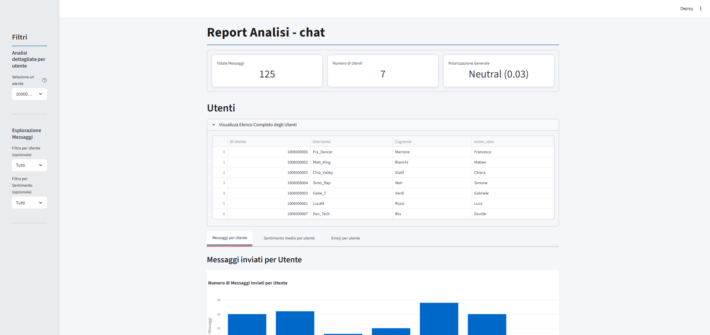
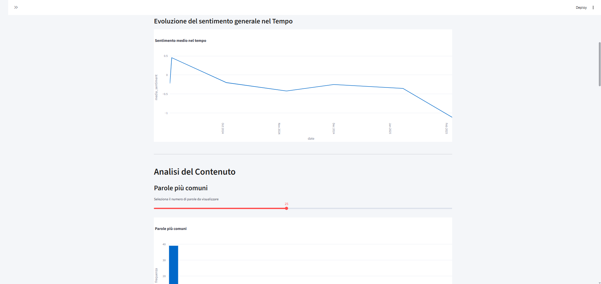
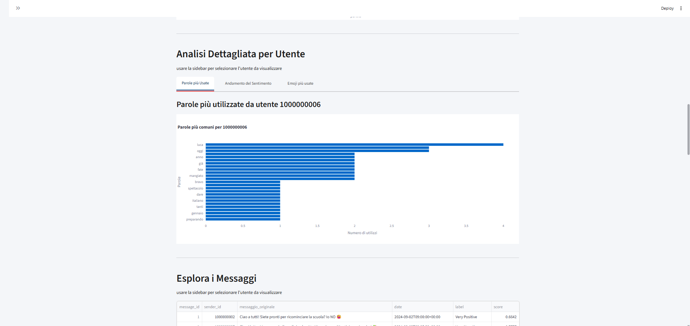
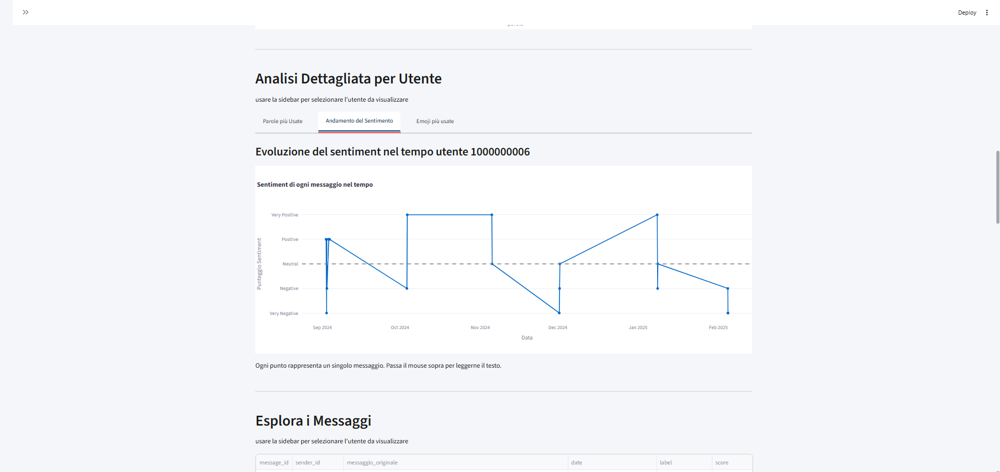
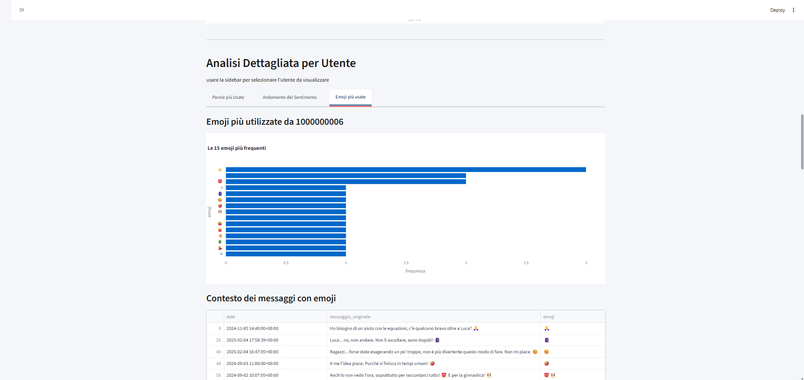
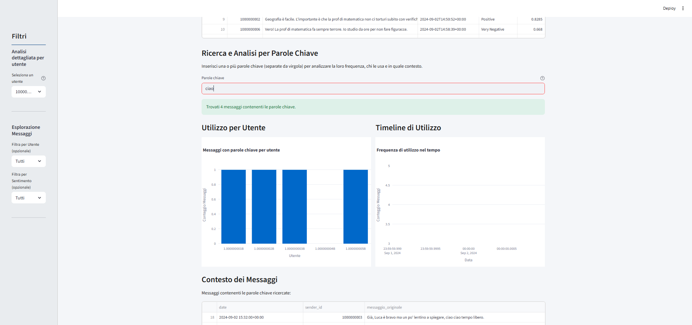
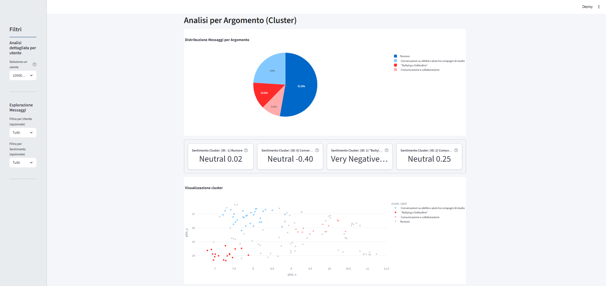
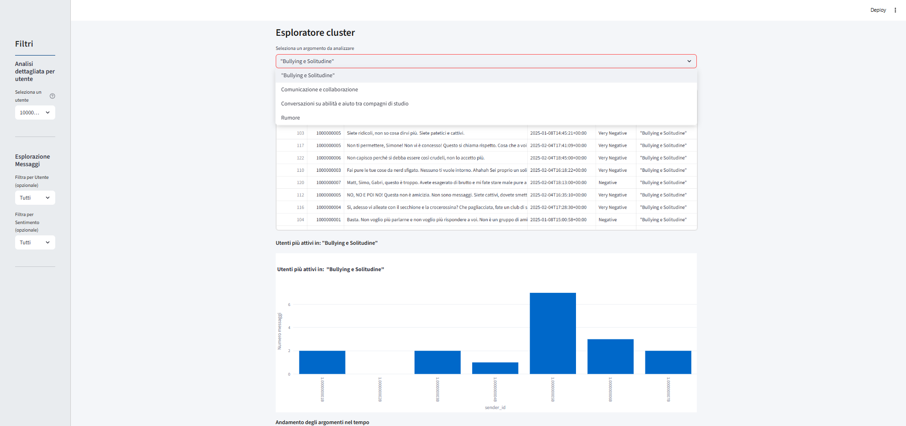

# BigBrother

> **Analisi automatizzata di gruppi Telegram**  
> _Progetto di tesi triennale – Università degli Studi di Torino_

[](https://www.python.org/)
[](https://huggingface.co/transformers/)
[](https://streamlit.io/)
[](https://www.deepl.com/)
[](https://ollama.com/)

---

La crescente mole di dati non strutturati provenienti dalle piattaforme di messaggistica istantanea rappresenta una sfida significativa per l'analisi investigativa, generando un sovraccarico informativo che rallenta e complica le indagini. BigBrother nasce come risposta a questa sfida: un prototipo software che orchestra una pipeline completa per trasformare conversazioni Telegram caotiche in intelligence strutturata e azionabile.
Sfruttando tecniche avanzate di Natural Language Processing (NLP) e Large Language Models (LLM), il sistema automatizza l'acquisizione dei dati, l'analisi del sentimento, il raggruppamento per argomenti (Topic Modeling) e la presentazione dei risultati in una dashboard interattiva progettata per l'esplorazione investigativa. L'obiettivo è fornire all'analista uno strumento di supporto per identificare rapidamente pattern, attori chiave e temi critici, riducendo drasticamente i tempi di analisi manuale.

Prova la demo su [bigbrother.streamlit.app](https://bigbrother.streamlit.app/).

---

## Screenshots della Dashboard

<details>
  <summary>🖼️ Clicca qui per vedere un'anteprima dell'interfaccia</summary>
  
  ### 1. Panoramica Generale
  *La dashboard offre una visione d'insieme con le metriche chiave: totale messaggi, numero di utenti e polarizzazione generale della chat. L'analisi degli utenti è organizzata in pratiche tab che mostrano messaggi, sentiment medio e uso di emoji per ciascun partecipante.*
  

  ---
  
  ### 2. Analisi Globale dei Contenuti
  *Visualizzazioni aggregate mostrano l'evoluzione del sentiment nel tempo e le parole più comuni utilizzate in tutta la chat, con uno slider interattivo per regolare il numero di parole visualizzate.*
  

  ---

  ### 3. Analisi Dettagliata per Utente
  *Selezionando un utente dalla sidebar, è possibile esplorare in dettaglio la sua attività specifica attraverso tre diverse sezioni: parole più usate, andamento del sentiment personale ed emoji preferite.*

| Parole più Usate dall'Utente | Andamento del Sentiment Personale | Emoji più Utilizzate |
| :---: | :---: | :---: |
|  |  |  |

  ---
  
  ### 4. Ricerca per Parole Chiave
  *Una potente funzionalità di ricerca permette di analizzare l'uso di parole chiave specifiche, mostrando chi le utilizza, con quale frequenza nel tempo e il contesto esatto dei messaggi, con le parole cercate evidenziate in rosso.*
  

  ---
  
  ### 5. Analisi per Argomento (Clustering)
  *I messaggi vengono raggruppati in cluster tematici per identificare gli argomenti principali. La dashboard visualizza la distribuzione degli argomenti, il sentiment medio di ciascun cluster e una mappa interattiva per esplorare la vicinanza semantica dei messaggi.*
  

  ---

  ### 6. Esploratore di Cluster
  *È possibile selezionare un argomento specifico da un menu a tendina per analizzarne in dettaglio i messaggi, gli utenti più attivi e l'evoluzione della sua popolarità nel tempo.*
   

</details>

---

## Stack Tecnologico

-   **Linguaggio e Core Libraries**:
    -   **Python 3.9.10**: Linguaggio di programmazione principale.
    -   **Pandas**: Per la manipolazione e l'analisi efficiente di dati tabulari.

-   **Acquisizione Dati e Traduzione**:
    -   **Telethon**: Per l'interazione con l'API di Telegram, agendo come client utente per accedere alla cronologia completa delle chat.
    -   **DeepL API**: Per la traduzione automatica dei testi in inglese, scelta motivata dall'alta qualità necessaria a massimizzare le performance dei modelli NLP.

-   **Natural Language Processing (NLP)**:
    -   **Hugging Face Transformers**: Per l'analisi del sentiment, utilizzando il modello pre-addestrato `tabularisai/multilingual-sentiment-analysis`.
    -   **NLTK**: Per la rimozione delle stopword durante l'analisi delle parole più comuni.
    -   **Sentence-Transformers**: Per la generazione di embedding testuali di alta qualità, che catturano il significato semantico dei messaggi.

-   **Topic Modeling e Clustering**:
    -   **BERTopic**: Framework avanzato per il clustering semantico dei messaggi e l'identificazione di argomenti latenti.
    -   **UMAP**: Algoritmo per la riduzione dimensionale degli embedding, utilizzato per la visualizzazione 2D dei cluster.

-   **Large Language Models (LLM)**:
    -   **Ollama**: Per l'esecuzione di modelli linguistici locali (es. Mistral) per la generazione automatica di etichette descrittive e interpretabili per i cluster identificati.

-   **Visualizzazione Dati**:
    -   **Streamlit**: Per la creazione rapida di una dashboard web interattiva e data-driven.
    -   **Plotly**: Per la generazione di grafici interattivi e dinamici all'interno della dashboard.

---

## Struttura del Progetto

-   `main.py`: Entry point del sistema. Orchestra l'esecuzione sequenziale di scraping, traduzione, analisi e clustering, per poi avviare la dashboard.
-   `scraper.py`: Modulo per la connessione a Telegram, la selezione di una chat e il download dei messaggi in formato CSV.
-   `traduttore.py`: Modulo che utilizza l'API di DeepL per tradurre i messaggi in inglese, implementando una gestione robusta del rate limiting.
-   `Analysis.py`: Contiene la logica per le analisi statistiche (frequenza messaggi, parole comuni, uso di emoji) e per la Sentiment Analysis. Salva i risultati in file CSV e grafici `.png`.
-   `clustering.py`: Esegue il topic modeling con BERTopic e, opzionalmente, interroga un LLM locale tramite Ollama per etichettare i cluster identificati.
-   `dashboard.py`: Definisce l'interfaccia utente web con Streamlit, visualizzando i risultati completi dell'analisi in modo interattivo.
-   `config.json`: File di configurazione per memorizzare le chiavi API (Telegram, DeepL) e le impostazioni del sistema (es. attivazione di Ollama e scelta del modello).
-   `clustering_prompt.txt`: Template del prompt utilizzato per istruire il LLM su come generare le etichette per i cluster.
-   `style.css`: Foglio di stile per personalizzare l'aspetto della dashboard Streamlit.
-   `requirements.txt`: Elenco delle dipendenze Python necessarie per eseguire il progetto.
-   `/data`: Directory principale dove vengono create le sottocartelle per ogni sessione di analisi, contenenti tutti i dati grezzi e i risultati elaborati.

---

## Flusso di Lavoro

1.  **Scraping**: `main.py` avvia `scraper.py`. L'utente si autentica su Telegram, seleziona una chat e il numero di messaggi da scaricare. I dati vengono salvati in un file `[nome_chat].csv` all'interno di una nuova cartella in `/data`.
2.  **Traduzione**: `traduttore.py` legge il CSV, traduce i messaggi in inglese tramite l'API di DeepL e salva i risultati nel file `[nome_chat]_tradotto.csv`.
3.  **Analisi**: `Analysis.py` processa il file tradotto, eseguendo analisi statistiche e di sentimento. I risultati vengono salvati in molteplici file CSV (es. `sentiment.csv`, `top_parole.csv`) e immagini (`.png`) nelle sottocartelle `/analisi` e `/grafici`.
4.  **Clustering**: `clustering.py` utilizza il file `sentiment.csv` e raggruppa i messaggi in cluster semantici usando BERTopic. Salva i risultati in `cluster.csv` e, se Ollama è attivo, genera le etichette in `cluster_label.csv`.
5.  **Aggregazione dei Percorsi**: Al termine della pipeline, `main.py` raccoglie tutti i percorsi dei file generati (CSV, grafici, etc.) e li salva in un unico file di configurazione `[nome_chat].json`.
6.  **Visualizzazione**: Infine, `main.py` lancia la dashboard (`dashboard.py`) passando il percorso del file `[nome_chat].json`. La dashboard carica dinamicamente tutti i dati e li presenta all'utente in modo interattivo.

---

## Come Eseguire il Progetto

1.  **Clona il repository**:
    ```bash
    git clone https://github.com/botta0oss/BigBrother.git
    cd BigBrother
    ```

2.  **Installa le dipendenze**:
    ```bash
    pip install -r requirements.txt
    ```

3.  **Configura le API e le impostazioni**:
    Crea il file `config.json` nella directory principale del progetto e inserisci le tue chiavi e impostazioni.

    *(Per ottenere `api_id` e `api_hash`, registrati su [my.telegram.org](https://my.telegram.org/auth). Per `auth_key`, registrati per un piano API su [DeepL.com](https://www.deepl.com/pro-api)).*

    Utilizza questo modello per il tuo `config.json`:
    ```json
    {
        "api_id": "IL_TUO_API_ID_TELEGRAM",
        "api_hash": "IL_TUO_API_HASH_TELEGRAM",
        "phone": "+391234567890",
        "ollama": true,
        "modello": "mistral",
        "auth_key": "LA_Tua_AUTH_KEY_DEEPL:fx"
    }
    ```
    -   `phone`: Il tuo numero di telefono associato all'account Telegram, in formato internazionale.
    -   `ollama`: Imposta su `true` per abilitare l'etichettatura automatica dei cluster, `false` per disabilitarla.
    -   `modello`: Il nome del modello che hai scaricato con Ollama (es. `mistral`, `llama3`).
    -   `auth_key`: Assicurati di includere il suffisso `:fx` se stai usando un account API gratuito di DeepL.

4.  **(Opzionale) Configura Ollama**:
    Per usare la funzione di etichettatura automatica dei cluster, assicurati di aver installato e avviato [Ollama](https://ollama.com/) e di aver scaricato il modello specificato nel `config.json`.
    ```bash
    # Esempio per scaricare il modello Mistral
    ollama pull mistral
    ```

5.  **Avvia il sistema completo**:
    ```bash
    python main.py
    ```
    Il terminale ti guiderà attraverso il processo di autenticazione e scraping. Al termine dell'intera pipeline di analisi, la dashboard di Streamlit si aprirà automaticamente nel tuo browser.

---

## Obiettivi della Tesi

-   Dimostrare la fattibilità di un sistema end-to-end per automatizzare l'intero flusso di analisi: dall'acquisizione dei dati grezzi da Telegram alla loro trasformazione in informazioni strutturate e visualizzabili.
-   Applicare e validare tecniche NLP avanzate per estrarre insight qualitativi, in particolare attraverso la Sentiment Analysis per mappare la polarità emotiva e il Topic Modeling per identificare i principali argomenti di discussione senza supervisione.
-   Introdurre un approccio innovativo per l'interpretabilità dei risultati, utilizzando un Large Language Model (LLM) locale per generare automaticamente etichette semantiche per i cluster di messaggi, risolvendo un comune problema del topic modeling.
-   Progettare una dashboard di visualizzazione che non sia un semplice report statico, ma uno strumento di esplorazione interattiva che guidi l'analista nella comprensione delle dinamiche relazionali e temporali della conversazione.
-   Validare l'utilità del prototipo in un contesto operativo realistico, dimostrando come possa supportare e accelerare il lavoro di un analista nell'individuare prove e informazioni rilevanti all'interno di grandi volumi di testo.

---

## Autore

**Francesco Bottacin**  
Laurea triennale in _Scienze Strategiche e della Sicurezza_  
**Università degli Studi di Torino**  
Anno accademico **2024/2025**
